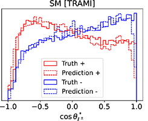
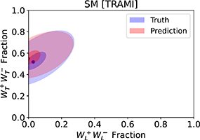
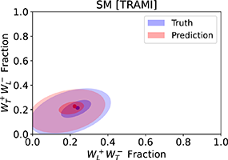

# WlWl Polarization
__<p align=center>Measure WWjj polarization fraction</p>__

<div align=center>
   <figure>
      
      
      
   </figure>
</div>
<p>
   
   Paper: [arXiv:2109.xxxxx](https://arxiv.org/abs/2109.xxxxx)  
   ___Notice: This code can only be used for the inference process, if you want to train your own model, please contact [zhangrao@stu.scu.edu.cn](mailto:zhangrao@stu.scu.edu.cn).___
   
</p>

## Requirements
* Both Linux and Windows are supported.
* 64-bit Python3.6(or higher, recommend 3.8) installation.
* Tensorflow2.x(recommend 2.6), Numpy(recommend 1.19.5).
* One or more high-end NVIDIA GPUs(at least 4 GB of DRAM), NVIDIA drivers, CUDA(recommend 11.4) toolkit and cuDNN(recommend 8.2.x).

## Preparing dataset
The raw dataset needs to be transformed before it can be imported into the model.
* You need to create a raw dataset(we provide a test dataset, stored in `./raw/`), the data structure is as follows:
```
The file has N events:
   Event 1
   Event 2
   ...
   Event N
One event for every 6 lines:
   1. first lepton 
   2. second lepton 
   3. first FB jet 
   4. second FB jet 
   5. MET 
   6. remaining jet 
Each line has the following five columns of elements:
   1.ParticleID  2.Px  3.Py  4.Pz  5.E
The format of an event in the dataset is as follows:
   ...
   -1.0  166.023   5.35817   10.784    166.459
   1.0   -36.1648  -64.1513  -28.9064  79.113
   7.0   -11.3233  -39.6316  -318.178  320.85
   7.0   -34.2795  22.0472   622.79    624.128
   0.0   -22.6711  52.8976   -422.567  426.468
   6.0   -49.9758  29.3283   274.517   294.098
   ...
```
ParticleID: 1 for electron, 2 for muon, 3 for tau, 4 for b-jet, 5 for normal jet, 0 for met, 6 for remaining jets, 7 for forward backward jet, signs represent electric charge.
* Use the command `python create_dataset.py YOUR_RAWDATA_PATH`, it will create a file with the same name as `YOUR_RAWDATA_PATH` in the `./dataset/`.
## Using pre-trained models
After completing the preparation of the dataset, you can use the model to predict the polarization fraction.
* Pre-trained weights are placed in `./weights/`.
* Use the command `python inference.py --dataset YOUR_TRADATA_NAME --model_name <MODEL_NAME> --energy_level <ENERGY_LEVEL>`, it will give the polarization fractions.

___Notice: <ENERGY_LEVEL> should correspond to the collision energy of events.___
## Example
Run the following command to get the polarization fractions for the standard model:
```
python create_dataset.py ./raw/sm.dat
python inference.py --dataset sm --model_name TRANS --energy_level 13
```
## Citation
```
@article{cite,
    author = "Jinmian Li, Cong Zhang, Rao Zhang",
    title = "{Polarization measurement for the dileptonic channel of $W^+ W^-$ scattering using generative adversarial network}",
    eprint = "2109.xxxxx",
    archivePrefix = "arXiv",
    primaryClass = "hep-ph",
    month = "9",
    year = "2021"
}
```
